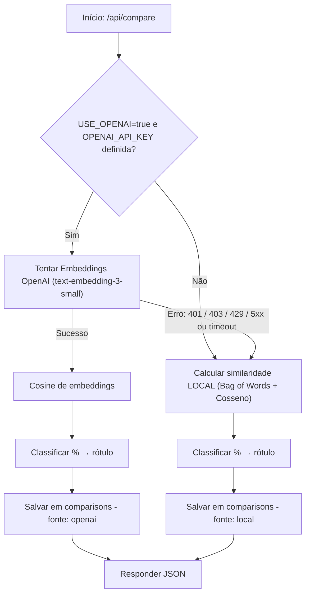

# 📝 API Detector de Plágio com Fallback

API para detecção de similaridade de textos com suporte a fallback para cálculo local quando a API da OpenAI não está disponível.

## 📌 Recursos da API
    - FastAPI
    - Framework principal para criação da API REST.
    - Suporte a documentação automática via Swagger/OpenAPI.
    
    Autenticação e Segurança
        - JWT (JSON Web Token) para autenticação de usuários.
        -API Key para validação adicional de acesso (X-API-KEY).

    Banco de Dados
        - PostgreSQL como banco principal (com suporte ao Supabase).
        - SQLAlchemy ORM para mapeamento objeto-relacional.
    
    Persistência de Histórico
        - Registro de todas as comparações de textos com origem (openai ou local) e resultados.

    Fallback Inteligente
        - Uso do OpenAI Embeddings (text-embedding-3-small) para comparação semântica.
        - Caso a API da OpenAI não esteja configurada ou retorne erro (401/403/429/5xx), a API executa um cálculo de similaridade local usando Bag of Words + Cosseno.

    Camada de Serviços
        - Separação da lógica de comparação em compare_service.py.
        - Camada de rotas (compare_routes.py) isolada.

    Configuração
        - Variáveis de ambiente via .env (evitando dados sensíveis no código).
        - Suporte opcional à chave da OpenAI.

    Documentação e Testes
        - Documentação interativa com Swagger UI.
        - Rotas e modelos tipados com Pydantic.

## 🚀 Funcionalidades

- Comparação de textos usando **OpenAI Embeddings** (quando disponível)
- Fallback para cálculo de similaridade local (Bag-of-Words + Cosseno)
- Autenticação **JWT**
- Controle de **API Key**
- Persistência de histórico no banco de dados (PostgreSQL / Supabase)

## 📋 Requisitos

- Python 3.10+
- Banco de dados PostgreSQL (pode usar Supabase)
- Pipenv ou virtualenv
- Chave da OpenAI *(opcional)*

---

## 📊 Fluxo Fallback


---

## 📦 Instalação

```bash
git clone https://github.com/seu-repo/ed-api-detector-python-backend.git
cd ed-api-detector-python-backend

python -m venv .venv
source .venv/bin/activate  # Linux/Mac
.venv\Scripts\activate     # Windows

pip install -r requirements.txt
