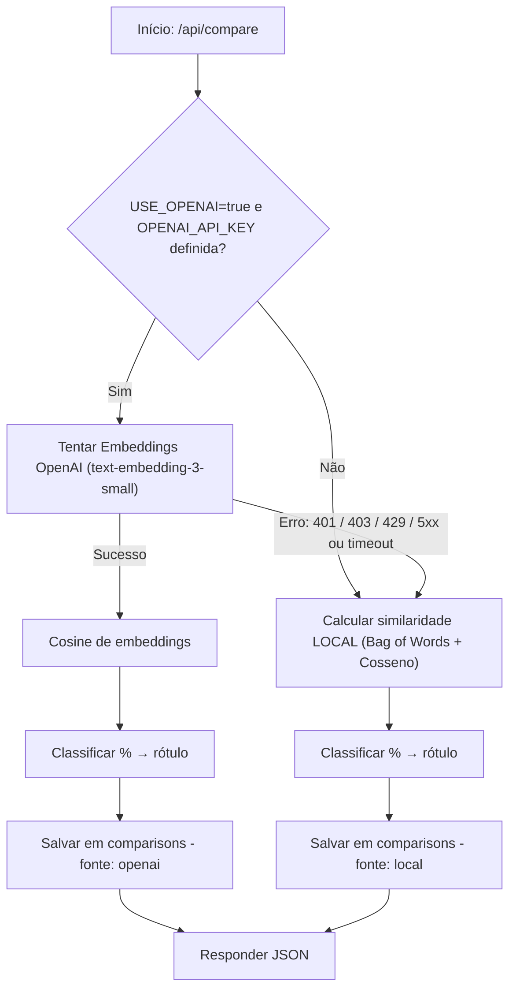

# 📝 API Detector de Plágio com Fallback

API para detecção de similaridade de textos com suporte a fallback para cálculo local quando a API da OpenAI não está disponível.

## 🚀 Funcionalidades

- Comparação de textos usando **OpenAI Embeddings** (quando disponível)
- Fallback para cálculo de similaridade local (Bag-of-Words + Cosseno)
- Autenticação **JWT**
- Controle de **API Key**
- Persistência de histórico no banco de dados (PostgreSQL / Supabase)

## 📋 Requisitos

- Python 3.10+
- Banco de dados PostgreSQL (pode usar Supabase)
- Pipenv ou virtualenv
- Chave da OpenAI *(opcional)*

---

## 📊 Fluxo Fallback


---

## 📦 Instalação

```bash
git clone https://github.com/seu-repo/ed-api-detector-python-backend.git
cd ed-api-detector-python-backend

python -m venv .venv
source .venv/bin/activate  # Linux/Mac
.venv\Scripts\activate     # Windows

pip install -r requirements.txt
